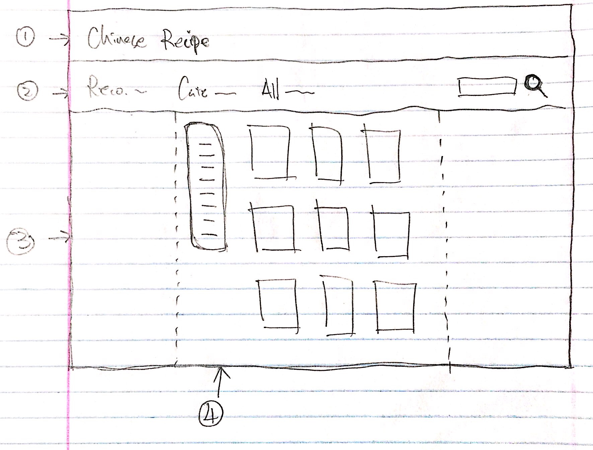
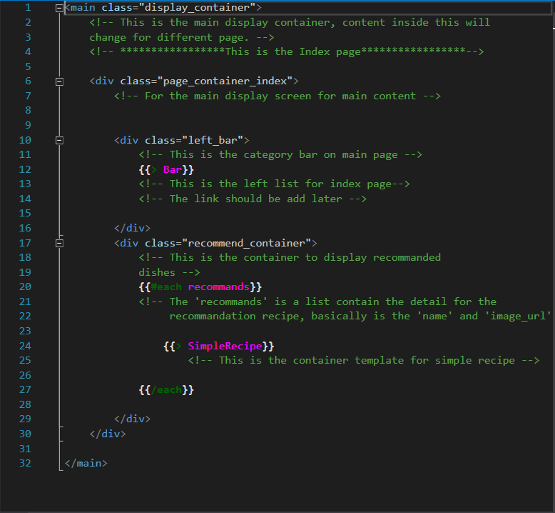
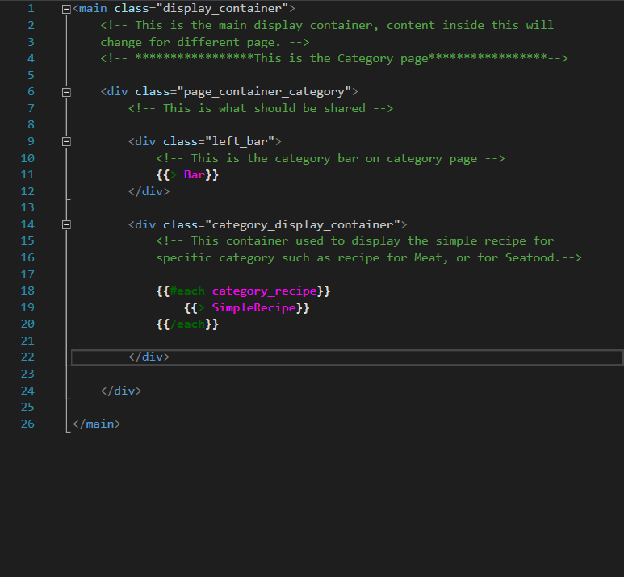
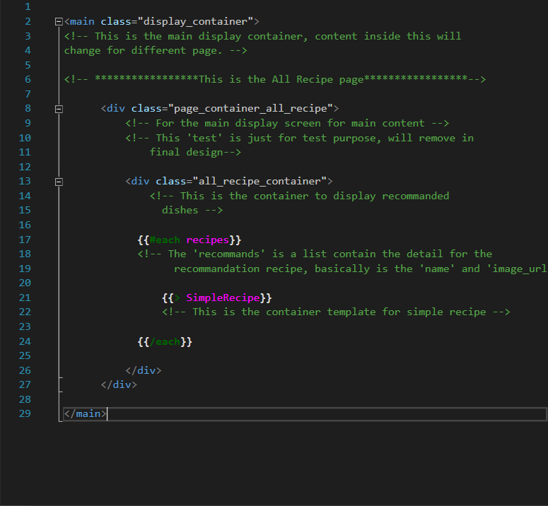
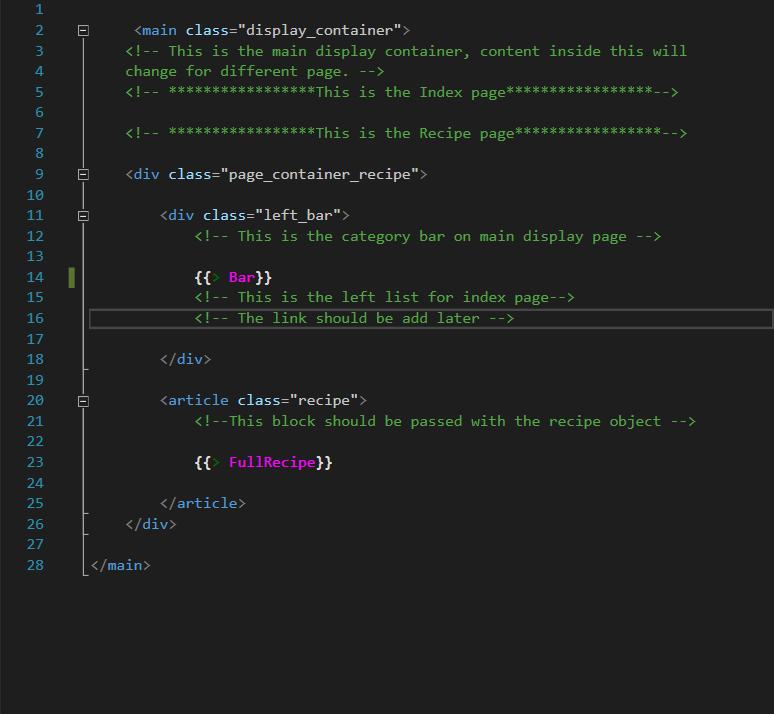

# Chinese Recipe Beta ver 1.2    by Group 26

This is the introduction for current v1.2 Beta Recipe application.

## Update v1.1 -> v1.2: See section "Update v1.2" at the bottom section.


-------------------------------------------------------------------------------------------------

## I. Display structure:



The main display for each page is same basically, the structure is consists by 4 part:
(The number is match with the number in the photo)

### 1. Title bar(**<header>**):

This is the title bar (the header) that will display the title of the web app.

### 2. Navigation bar(**class="navbar"**):

This is the bar that include the link for each page and the search bar.

### 3. Display container(**class="display_container"**):

This container tooks up all the space except the title and nav bar, and the size of 
it for each different page is basically the same, since the title and nv bar always
stay at the top of the window.

### 4. Page container(**class="page_container_(page name, such as index, category..)"**):

This container was set to be **centered** based on the display container, and all the
content of each page will go into this container.


-------------------------------------------------------------------------------------------------

## II. Variable Object:

Basically, there are two type of variables used in this app:

### 1. recipe_obj

```
{
	name: *The recipe's name*,
	photoURL: *The URL of the photo that will be displayed*,
	ingredient: *The ingredient of the recipe, separate each ingredient by ';'*,
	direction: *The steps for how to make the recipe, separate each step by ';'*
}

for example:

{
name: 'Stir - Fried Shrimp and Scallions',
photoURL: 'https://imagesvc.timeincapp.com/v3/mm/image?url=https%3A%2F%2Fcdn-image.foodandwine.com%2Fsites%2Fdefault%2Ffiles%2Fstyles%2Fmedium_2x%2Fpublic%2F200911-xl-mama-changs-stir-fried-shrimp-and-scallions.jpg%3Fitok%3DdORctdLA&w=800&q=85',
ingredient: "1/2 pounds shelled and deveined large shrimp; 3 garlic clovesSliced One; 1-inch piece of fresh ginger",
direction: "Step 1: In a large bowl, toss the shrimp with the garlic, ginger, red pepper, egg white and 1 teaspoon of the cornstarch until well-coated; Step 2: In a medium bowl, whisk the ketchup with the broth, sugar, pepper, salt and the remaining 1 teaspoon of cornstarch; Step 3: In a very large skillet, heat the oil until shimmering. Add the shrimp and stir-fry over high heat until they begin to turn pink. Add the ketchup mixture and simmer until the shrimp are cooked, about 2 minutes. Stir in the scallions and cilantro and serve."
}
```

This object will used to generate the:
1. **SimpleRecipe** which will be displayed at the index page and category page.
2. **FullRecipe** which will be displayed at the single recipe page.

The template's name is the same with the name on top, **SimpleRecipe.handlebars** and
**FullRecipe.handlebars**.

### 2. category_obj

```
{
	name: *The category's name*,
	photoURL: *Category's photo's URL*
}
	
for example:

{
    name: 'Meat',
    photoURL: 'Photos/meat.jpg'
}
```

You don't need to change or create any of this variables, it's already been created and 
used on the category page.
(Now there only three of this, I will complete the list in next version)

You can find the example of this two variables in the **server.js** file.


-------------------------------------------------------------------------------------------------

## III. File Structure:

For this part, I will go through each part of the template, include the already functioned part
and the part that need to update in next version.

### 1. Main Template - Index.handlebars



This is the index/home page of the website, and it was consists by these part:

**1. Bar**

This is the left bar of the index page, basically it's a category bar. The partial template
was already created, don't need any argument.

When user click the link/button which is the name of the category, the page should 
request the recipe that contain both **(category_name)** and **recommend** tag, and 
then the recipe list should be displayed on the screen using the **SimpleRecipe** template,
which is already included in this template. The only thing need to be done is to generate 
a new page request that pass the target recipe list as argument to this template.

**2. Recommand Recipes**

This is a **for loop** with the **recommends** argument passed into this template,
the **recommends** is a list contain all the **recipe object** that will be displayed 
in this page as recommended recipe.


### 2. Main Template - Category.handlebars



This is the page that will display all the recipes for a specifc category, such as Meat,
Seafood, Vegetable......

And it contains these part:

**1. Bar**

This is almost the same bar as the index page have, but when user accessing the button/link
in this bar, the function should only send the **(category_name)** to server and request **all**
the recipes under the target category, and then the recipe list will be passed as arguement to 
generate new category page for specific category.

**2. category_recipe**

This is the same function with the second part in the index page, it will take a recipe list
and generate simple recipe modal on the left.


### 3. Main Template - AllRecipes.handlebars



This template is for the **All Recipe** page, it will simply take a recipe list that contain all
the recipe object from all category and generate the simple recipe template in this page.

It contain this part:

**1. recipes**

This is still a for loop that take all recipe object then generate the simple recipe modal,
just like the index and category page.


### 4. Main Template - SingleRecipe.handlebars



This is the page that will display all the detail information for a single recipe, if user click
any single recipe, the application should lead the user to this page for that specific recipe.

 
It contains these part:

**1. Bar**

This is just the same bar as the **category page**, it will lead user to the specific category page,
that means it will send the request of **(category_name)** and generate a **category page** that 
contains target recipe list.

**2. Full Recipe**

This partial template will receive a **single recipe object** as arguement then generate a full-recipe
page that shows all the information of that recipe.

**Attention!**: Still need the function to convert the **ingredient and direction** from string to list!!


### 5. Main Template - AddRecipe.handlebars

***Still Working, not available currently***


-------------------------------------------------------------------------------------------------

## IV. What still need?

1. The data base code:

	1.1. Add new object into data base.

2. The JavaScript code:

	2.1. Send request when click a specific recipe to generate the single recipe page.

	2.3. Convert the ingredient and direction from string with **';'** into listed paragraph element, see detail in **FullRecipe.handlebar**

	2.4. The search functionality code for search bar.

3. Server.js

	3.1. Write function to handle request for single recipe page.


-------------------------------------------------------------------------------------------------


# Update


## Update v1.2

**1. Create the server for recipe data:**

	Host Name: cluster0-bmwdm.gcp.mongodb.net
	User Name: group26
	Pass Word: group26
	DataBase name: chinese_recipe
	Collection name: recipe_list

	**All new recipe should follow the new data structure and directly put into this collection.**

	The recipe data are all already in the data base.


**2. Change the data structure of the recipe object:**

```
	**Old:**

	{
	name: *The recipe's name*,
	photoURL: *The URL of the photo that will be displayed*,
	ingredient: *The ingredient of the recipe, separate each ingredient by ';'*,
	direction: *The steps for how to make the recipe, separate each step by ';'*
	}

	**New:**

	{
	name: *The recipe's name*,
	photoURL: *The URL of the photo that will be displayed*,
	ingredient: *The ingredient of the recipe, separate each ingredient by ';'*,
	direction: *The steps for how to make the recipe, separate each step by ';'*
	category: *The category name with uppercase for first letter, such as Meat(not meat)*
	recommend: *Value Yes if is the recommend recipe, don't change or add new value to this tag!!!*
	}
```


**3. Change the server.js to add the server code:**

	Added:
	1). Index page
	2). All Recipe page
	3). Category page
	4). Category: Specific_Category page


**4. Add photo of recipe into public/Photos.**


**See remained task for IV. What Still Need**

